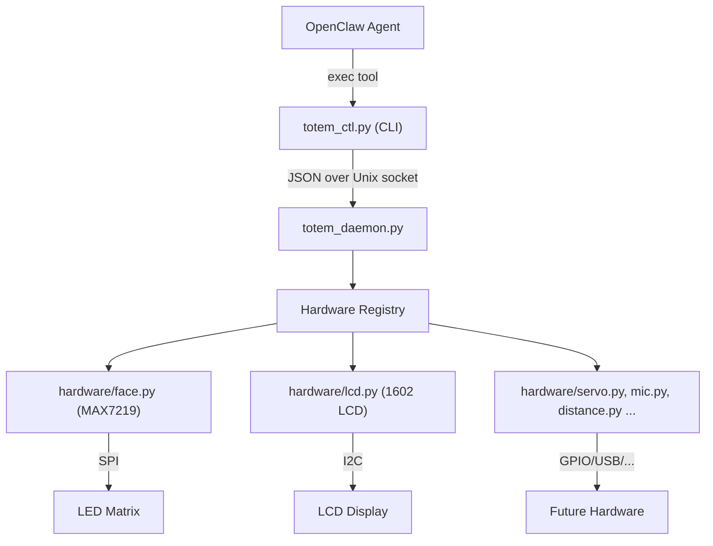

# Totem OpenClaw Hardware Skill

## Design Philosophy: Maximum AI Control

Every hardware module exposes **two tiers** of control:

- **High-level convenience actions** - Named shortcuts for common operations (e.g., `face expression happy`, `lcd write "Hello"`). Fast, simple, predictable.
- **Low-level primitives** - Direct access to the underlying library APIs (e.g., `face pixel 3 4 1`, `lcd create_char 0 '[...]'`, `lcd raw_command 0x01`). The AI can compose these to create behaviors we never anticipated.

Additionally:

- **Batch commands** let the AI coordinate multiple devices atomically in one call
- **Capabilities discovery** lets the AI query what hardware is available at runtime (future-proofing for new modules)
- **Custom animation authoring** lets the AI design and play its own frame-by-frame animations without code changes
- **Custom LCD characters** let the AI design tiny 5x8 pixel icons for creative display use

## Architecture




## File Structure

All new files live inside the existing `/Users/daniel/dev/totem/` project:

```
totem/
├── hardware/                  # NEW - Modular hardware package
│   ├── __init__.py
│   ├── base.py                # HardwareModule abstract base class
│   ├── face.py                # MAX7219 face (expressions, animations, custom bitmaps)
│   └── lcd.py                 # 1602 LCD (text, backlight, progress bar, scrolling)
├── expressions.py             # NEW - Face bitmap library (all 8x8 grids)
├── totem_daemon.py            # NEW - Background daemon (Unix socket server)
├── totem_ctl.py               # NEW - Thin CLI client (sends JSON to daemon)
├── skills/
│   └── totem/
│       └── SKILL.md           # NEW - OpenClaw skill definition
├── face.py                    # EXISTING - keep as reference
├── lcd_test.py                # EXISTING - keep as reference
├── totem_core.py              # EXISTING - keep as reference
└── requirements.txt           # EXISTING - no new deps needed
```

## Component Details

### 1. `hardware/base.py` - Hardware Module Interface

Abstract base class that all hardware modules must implement:

```python
class HardwareModule(ABC):
    name: str                              # e.g. "face", "lcd", "servo"
    
    def init(self) -> None                 # Initialize hardware
    def cleanup(self) -> None              # Safe shutdown
    def handle_command(self, action, params) -> dict  # Process a command
    def get_state(self) -> dict            # Return current state
    def get_capabilities(self) -> list     # List available actions
```

Every future hardware addition (servo, mic, distance sensor, touch) just creates a new file in `hardware/` implementing this interface and registers with the daemon. No other code changes needed.

### 2. `hardware/face.py` - Face Module (Full Pillow ImageDraw API)

Refactors existing code from [face.py](face.py) and [totem_core.py](totem_core.py) into the `HardwareModule` interface. Exposes the full `PIL.ImageDraw` drawing surface (8x8 pixels) so the AI can draw anything it wants.

**High-level actions (convenience):**

- `expression` - Set a named expression (neutral, happy, sad, angry, surprised, thinking, confused, sleepy)
- `animate` - Start a named background animation (thinking, speaking, listening, sleeping, idle_blink)
- `stop` - Stop any running animation
- `blink` - Single eye blink

**Low-level drawing primitives (full creative control):**

- `custom` - Draw an arbitrary 8x8 bitmap grid (list of 8 lists of 8 ints)
- `pixel` - Set or clear individual pixel at (x, y)
- `line` - Draw line from (x1,y1) to (x2,y2)
- `rect` - Draw rectangle outline or filled
- `ellipse` - Draw ellipse/circle outline or filled
- `clear` - Clear the display (all pixels off)
- `invert` - Invert all pixels on the display
- `brightness` - Set LED brightness (0-255)
- `text` - Draw a single character using a tiny pixel font

**Animation authoring (AI creates its own animations):**

- `sequence` - Play a custom animation: accepts a list of frames, where each frame is an 8x8 grid + duration in ms. Runs in background thread. This lets the AI design novel animations at runtime without any code changes.

**Internal buffer approach:** The face module maintains an internal 8x8 pixel buffer. Drawing primitives modify the buffer and flush to hardware. This means the AI can compose multiple draw calls (e.g., draw a line, then a point, then a rect) before seeing the result -- or use `flush: false` to batch multiple draws and then explicitly flush.

### 3. `hardware/lcd.py` - LCD Module (Full RPLCD API Surface)

Refactors existing code from [lcd_test.py](lcd_test.py) and [totem_core.py](totem_core.py). Exposes the full HD44780 capability set so the AI has complete control over every character cell and can create custom icons.

**High-level actions (convenience):**

- `write` - Write text to line 1 and/or line 2 (with optional alignment: left/center/right)
- `scroll` - Scroll long text across the display
- `progress` - Show a progress bar with label

**Low-level LCD control (full creative control):**

- `write_at` - Write a string starting at any (row, col) position
- `clear` - Clear the display and reset cursor
- `home` - Reset cursor to (0,0) without clearing
- `cursor` - Move cursor to any (row, col) position
- `cursor_mode` - Set cursor behavior: "hide", "line", or "blink"
- `display` - Toggle character display on/off (hides text without erasing)
- `backlight` - Toggle backlight on/off
- `shift` - Shift entire display content left or right by N positions
- `create_char` - Define a custom 5x8 pixel character in one of 8 CGRAM slots (0-7). Accepts a list of 8 integers, each representing a 5-pixel row. The AI can design tiny icons (arrows, thermometers, battery levels, custom emoticons, progress blocks, etc.)
- `write_char` - Write a previously created custom character by slot number (0-7) at current cursor position
- `raw_command` - Send a raw HD44780 command byte (full hardware access)
- `raw_write` - Write a raw byte to the display

**Custom character example:** The AI could create a tiny heart icon and display it:

```
totem_ctl lcd create_char 0 '[0,10,31,31,14,4,0,0]'
totem_ctl lcd write_at 0 0 "I "
totem_ctl lcd write_char 0
totem_ctl lcd write_at 0 3 " Totem"
```

This gives the AI 8 programmable character slots -- enough to create custom UI elements like animated spinners, bar graph segments, sensor icons, or even tiny pixel art.

### 4. `expressions.py` - Face Bitmap Library

Centralizes all 8x8 face grids from existing code plus new ones:

- `NEUTRAL`, `HAPPY`, `SAD`, `ANGRY`, `SURPRISED`, `THINKING`, `CONFUSED`, `SLEEPY`
- `TALK_OPEN`, `TALK_CLOSED` (for speaking animation)
- `BLINK` (eyes closed frame)
- `HEART`, `SKULL`, `ARROW_UP`, etc. (fun extras)

### 5. `totem_daemon.py` - The Daemon

- Starts a Unix socket server at `/tmp/totem.sock`
- On startup, discovers and initializes all hardware modules from `hardware/`
- Listens for JSON commands: `{"module": "face", "action": "expression", "params": {"name": "happy"}}`
- Returns JSON responses: `{"ok": true, "data": {...}}` or `{"ok": false, "error": "..."}`
- Handles concurrent animation threads
- Graceful shutdown on SIGTERM/SIGINT
- Includes a `--status` flag to check if daemon is running
- Compound commands: supports `{"module": "totem", "action": "express", ...}` for coordinated face+LCD actions
- **Batch command support**: accepts `{"batch": [cmd1, cmd2, ...]}` to execute multiple commands atomically in a single call. This lets the AI coordinate face + LCD + future hardware in one round-trip (e.g., set expression + write LCD + move servo simultaneously)
- **Capabilities endpoint**: `{"action": "capabilities"}` returns a full list of every module, every action, and every parameter -- so the AI can dynamically discover what hardware is available and what it can do

### 6. `totem_ctl.py` - The CLI

Thin client using argparse with subcommands. Connects to daemon socket and sends JSON. Also supports a `--json` raw mode so the AI can send arbitrary JSON commands (including batch) directly.

```
Usage:
  # --- Face: High-level ---
  totem_ctl face expression happy
  totem_ctl face animate thinking
  totem_ctl face animate speaking --duration 3
  totem_ctl face stop
  totem_ctl face blink
  totem_ctl face brightness 128

  # --- Face: Low-level drawing ---
  totem_ctl face custom '[[0,0,1,...],...]'
  totem_ctl face pixel 3 4 1                   # set pixel (3,4) on
  totem_ctl face line 0 0 7 7                  # diagonal line
  totem_ctl face rect 1 1 6 6 --fill           # filled rectangle
  totem_ctl face ellipse 1 1 6 6               # circle
  totem_ctl face clear
  totem_ctl face invert
  totem_ctl face text 0 0 "A"                  # draw character at position
  totem_ctl face sequence '[{"grid":[[...],...], "ms": 200}, ...]'  # custom animation

  # --- LCD: High-level ---
  totem_ctl lcd write "Hello World" --line2 "Status OK" --align center
  totem_ctl lcd scroll "This is a long scrolling message"
  totem_ctl lcd progress 75 --label "Loading"

  # --- LCD: Low-level ---
  totem_ctl lcd write_at 0 5 "Hi"             # write at row 0, col 5
  totem_ctl lcd clear
  totem_ctl lcd home
  totem_ctl lcd cursor 1 8                     # move cursor to row 1, col 8
  totem_ctl lcd cursor_mode blink              # hide | line | blink
  totem_ctl lcd display off                    # hide characters without clearing
  totem_ctl lcd backlight off
  totem_ctl lcd shift -2                       # shift display left by 2
  totem_ctl lcd create_char 0 '[0,10,31,31,14,4,0,0]'   # heart icon in slot 0
  totem_ctl lcd write_char 0                   # write custom char from slot 0
  totem_ctl lcd raw_command 0x01               # raw HD44780 command

  # --- Compound & System ---
  totem_ctl express happy --message "Feeling great!"
  totem_ctl batch '[ {"module":"face","action":"expression","params":{"name":"happy"}}, {"module":"lcd","action":"write","params":{"line1":"Yay!"}} ]'
  totem_ctl capabilities                       # list all modules, actions, params
  totem_ctl status                             # current state of all hardware
  totem_ctl ping                               # check daemon is alive
```

### 7. `skills/totem/SKILL.md` - OpenClaw Skill

The skill file teaches the agent about:

- What Totem is and what hardware is available
- All available `totem_ctl` commands (high-level AND low-level) with examples
- When to use which expressions/animations (emotional context guidelines)
- How to coordinate face + LCD for natural interaction
- The `batch` command for atomic multi-device operations
- The `capabilities` command to discover available hardware dynamically
- That the daemon must be running (and how to start it)
- Encouragement to be creative: design custom faces, create custom LCD icons, author novel animations

Example frontmatter:

```yaml
---
name: totem-hardware
description: Control Totem robot hardware - LED face, LCD display, animations, and custom drawing. Run `totem_ctl capabilities` to discover all available hardware and actions.
metadata: {"openclaw":{"requires":{"bins":["python3"]}}}
---
```

The body teaches the agent things like:

- "You have FULL control over all hardware. Use `totem_ctl capabilities` to see everything available."
- "When you are thinking, run `totem_ctl face animate thinking` and `totem_ctl lcd write 'Processing...'`"
- "When you have an answer, run `totem_ctl face stop` then `totem_ctl face expression happy`"
- "Use `totem_ctl batch '[...]'` to coordinate multiple devices in a single call"
- "You can draw ANYTHING on the 8x8 LED matrix using pixel, line, rect, ellipse, or custom bitmap"
- "You can create up to 8 custom icons on the LCD using create_char (5x8 pixel bitmaps) -- use these for status indicators, sensor readings, or creative decoration"
- "You can design and play your own animations using the `sequence` command -- define frames and timing"
- "Use `totem_ctl status` to check the current state of all hardware before making changes"

**Design principle for the skill:** The skill should explain capabilities and constraints (display dimensions, pixel counts, character limits) but avoid being overly prescriptive. The AI should feel empowered to experiment and compose creative combinations.

## Adding Future Hardware

To add a new sensor/actuator (e.g., servo motor):

1. Create `hardware/servo.py` implementing `HardwareModule`
2. Add new expressions or animations if relevant to `expressions.py`
3. Restart daemon -- it auto-discovers the new module
4. Update `SKILL.md` with the new `totem_ctl servo ...` commands
5. No changes needed to daemon, CLI, or other modules

## Dependencies

No new Python packages needed beyond what's already in [requirements.txt](requirements.txt). The daemon uses only stdlib (`socket`, `json`, `threading`, `argparse`, `signal`). Hardware libraries (`luma.led_matrix`, `RPLCD`, `spidev`, `smbus2`) are already installed.

---

### 8. `README.md` - Update

The current [README.md](README.md) covers Phase 1 (hardware setup, wiring, OS install) thoroughly. It needs the following additions:

**Phase 2 roadmap update** -- replace the current 4-item Phase 2 checklist with:

- `[ ]` Build hardware abstraction layer (`hardware/` package with `HardwareModule` interface)
- `[ ]` Build `totem_daemon.py` (background service for persistent hardware state)
- `[ ]` Build `totem_ctl.py` (CLI for controlling hardware via daemon)
- `[ ]` Install OpenClaw on the Pi
- `[ ]` Configure LLM connection (Anthropic recommended)
- `[ ]` Create `skills/totem/SKILL.md` (teach agent to control hardware)
- `[ ]` Enable TTS/STT voice features

**New section: "Part IV: Software Architecture"** -- added after Part III, covering:

- Architecture diagram (OpenClaw -> CLI -> Daemon -> Hardware Modules -> Physical Hardware)
- File structure tree showing all new files
- How to start the daemon: `python totem_daemon.py`
- How to test with CLI: `totem_ctl ping`, `totem_ctl face expression happy`
- How OpenClaw connects: the skill teaches the agent to call `totem_ctl` via exec

**New section: "Part V: OpenClaw Integration"** -- covering:

- Installing OpenClaw (`npm install -g openclaw@latest`)
- Copying the skill to `~/.openclaw/skills/totem/`
- Verifying the skill loads
- Starting the daemon as a background service before OpenClaw

### 9. `CONTRIBUTING.md` - Developer Guide for Adding Hardware

A standalone guide that serves as notes for both the human developer and any AI agent working on the project. Contains:

**The HardwareModule contract** -- full interface specification:

- Required properties: `name` (str), `description` (str)
- Required methods: `init()`, `cleanup()`, `handle_command(action, params)`, `get_state()`, `get_capabilities()`
- Return format for `handle_command`: `{"ok": True, "data": {...}}` or `{"ok": False, "error": "..."}`
- Return format for `get_capabilities`: list of dicts, each with `action`, `description`, `params` (with types and required flags)

**Worked example: Adding a servo motor** -- complete walkthrough:

Step 1: Wiring table template

```
| Servo Pin | T-Cobbler Label | Physical Pin | Function |
| --------- | --------------- | ------------ | -------- |
| Signal    | GPIO 18         | Pin 12       | PWM      |
| VCC       | 5V              | Pin 2/4      | Power    |
| GND       | GND             | Pin 6/9      | Ground   |
```

Step 2: Create `hardware/servo.py`

```python
class ServoModule(HardwareModule):
    name = "servo"
    description = "SG90 servo motor for head/neck movement"

    def get_capabilities(self):
        return [
            {"action": "angle", "description": "Set servo angle", "params": {"degrees": {"type": "int", "min": 0, "max": 180, "required": True}}},
            {"action": "nod", "description": "Nod motion", "params": {"times": {"type": "int", "default": 2}}},
            {"action": "shake", "description": "Shake motion", "params": {"times": {"type": "int", "default": 2}}},
            {"action": "center", "description": "Return to center (90 degrees)", "params": {}},
        ]
```

Step 3: Restart daemon (auto-discovers new module)
Step 4: Test via CLI: `totem_ctl servo angle 90`, `totem_ctl servo nod`
Step 5: Update `SKILL.md` with new servo commands
Step 6: Update `README.md` wiring table
Step 7: Add pip dependency to `requirements.txt` if needed

**Planned hardware modules** -- reference list for future development:

- `hardware/servo.py` -- SG90 servo (GPIO PWM, pin 18) -- head nod/shake, set angle
- `hardware/distance.py` -- HC-SR04 ultrasonic (GPIO trigger + echo) -- read distance, proximity events
- `hardware/temperature.py` -- DHT11 (GPIO data pin) -- read temp/humidity
- `hardware/microphone.py` -- USB mic or ReSpeaker 4-Mic Array -- audio levels, voice detection
- `hardware/speaker.py` -- 3.5mm or USB speaker -- play sounds, TTS output
- `hardware/camera.py` -- USB webcam (Pi 400 has no CSI port) -- capture image, motion detection
- `hardware/touch.py` -- capacitive touch sensor (GPIO) -- detect touch events
- `hardware/neopixel.py` -- WS2812B LED strip (GPIO 18 with PWM) -- ambient lighting, mood colors

**Wiring documentation template** -- every new module should document:

- Component name and model
- Interface type (SPI / I2C / GPIO / USB)
- Pin connections table
- Required pip packages
- I2C address or SPI device (if applicable)
- Test command after wiring

